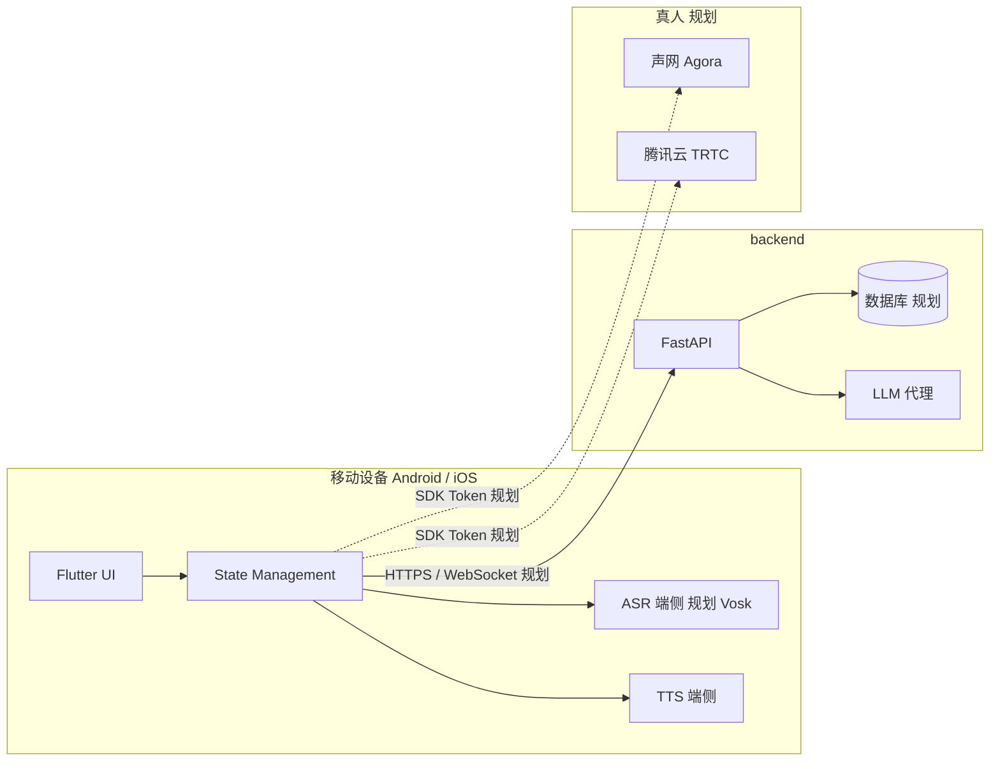

# MyEnglishChat 技术架构说明

**文档类型**：工作区技术总览（含【现状】与【规划】）。  
**读者**：维护者、协作者、AI 辅助编程（修改代码前应通读本文与 **`.cursor/rules/myenglishchat.mdc`**）。  
**关联文档**：[`MyEnglishChat-product-intro.md`](./MyEnglishChat-product-intro.md)（产品叙述）。

**后端能力清单**：见 **§5.2**。

---

## 1. 文档维护约定

- **应更新本文**的情况包括：
  - **`app_flutter/lib/`** 分层或 feature 边界显著变化；
  - **`backend/`** 增加或变更 App **会调用**的对外路由；
  - **Base URL / 鉴权** 约定变化；**RTC**（声网 / 腾讯云）选型落定；
  - 产品 Tab 与代码入口对应关系变化。
- **以仓库实际代码为准**；【规划】未落地前**不得虚构**已存在的类或接口。

---

## 2. 工作区与仓库边界

| 路径 | 角色 | 说明 |
|------|------|------|
| `app_flutter/` | **Flutter 客户端（主产品）** | Android + iOS；Material 3；HTTPS 对接 `backend/` |
| `backend/` | **正式后端** | Python + FastAPI；**对外 API 以本目录为准** |
| `English-Chat/` | **历史网页（仅参考）** | 不扩展网页前端；可读 Python 路由与业务以辅助 **`backend/`** |
| `docs/` | 文档 | 本产品介绍与本架构说明 |
| `.cursor/rules/` | AI 协作规则 | **`myenglishchat.mdc`** 为主；**`code-hygiene-and-reuse.mdc`** 为补充 |

原独立 Kotlin 工程已移除；移动端能力均在 **`app_flutter/`**。

---

## 3. 逻辑架构（总览）



**【现状】**：主客户端 **`app_flutter/`**；Practice 文本对话已调 **`POST /api/practice/chat`**；语音转写仍为占位，LLM 密钥仅在 **`backend`**。  
**【规划】**：端侧 Vosk 转写；数据库与鉴权按产品迭代接入；P2P 为 **Agora / TRTC** 二选一。

---

## 4. Flutter 应用（`app_flutter/`）

### 4.1 技术栈（骨架现状）

| 项 | 约定 / 依赖 |
|----|----------------|
| UI | Material 3；Echo 主题见 `core/theme/echo_theme.dart` |
| 状态 | **Riverpod** 已在 `pubspec.yaml`（可按 screen 逐步采用） |
| 网络 | **Dio**；客户端 `lib/data/http/dio_client.dart`；Base URL **`core/config/env.dart`** |
| 语音相关 | **`record`** 录音；**`just_audio`** / **`flutter_tts`** 播放；**Vosk** 待接入 |
| 字体 | **`google_fonts`**（如 Shadowing 选题页） |

### 4.2 目录结构（约定 + 现状）

**依赖方向**：**features → data → core**；禁止 **data → features**。

**目标形态（不必空建目录）**：顶层固定为 `app/`、`core/`、`data/`、`features/`；`core` 常见 `config/`、`theme/`、`utils/`；`data` 常见 `http/`、`dto/`、`repositories/`。`features/<name>/` 已按 **`presentation/`**（页面与 Widget）、**`domain/`**（路由常量、与 UI 耦合的模型等）拆分；**`application/`**（Controller/Notifier）待按需引入。DTO 与 UI 长期分叉时加 `data/mappers/`；多 feature 共用录音/播放时再抽 `core/audio/` 等。

**当前仓库简图**（随 PR 更新）：

```
app_flutter/lib/
├── main.dart
├── app/           # app.dart、widgets（Echo 顶/底栏）
├── core/          # config/env、theme
├── data/          # http、dto、repositories
└── features/
    ├── home/presentation/
    ├── shadowing/domain/、presentation/
    ├── session/presentation/
    ├── practice/domain/、presentation/
    ├── ai_dialogue/presentation/
    └── p2p/presentation/
```

### 4.3 目录演进：何时调整、怎么动

| 触发情况 | 建议 |
|----------|------|
| 单文件 **~400 行+** 或同文件同时改 UI + 录音 + API | 拆 **`presentation/`** + **`application/`**（或同级 `*_controller.dart`） |
| **两个 feature** 复制同款录音/播放/权限 | 抽到 **`core/<能力>/`** 或 **`data/local/`**（二选一，勿两套并行） |
| DTO 与界面字段反复手工映射易错 | **`data/mappers/`** 或 feature 内 mapper |
| 深链/多栈路由变复杂 | **`app/router/`**（如 go_router） |
| 独立新产品块 | 新建 **`features/<名>/`**，不塞进 `home/` |

结构性变更后更新 **本节**；协作规则 **`.cursor/rules/myenglishchat.mdc`** 仅保留指针，**不重复粘贴本表**。

### 4.4 导航与产品入口（现状）

- **外壳**：`HomeScreen` — `EchoTopBar` + **三 Tab 内容区** + `EchoBottomBar`；底栏路由名：`shadowing`、`ai_dialogue`、`p2p`。
- **Shadowing**：`ShadowingTabNavigator` 内嵌 **`Navigator`** — 场景列表 → **`ScenarioSessionScreen`** 时**底栏仍显示**（全屏 push 会破坏该行为）。
- **场景内**：`ScenarioSessionScreen` — 子 Tab **Shadowing**（跟读面板） / **Practice**（**`PracticeSessionPanel`**）。
- **Practice 与 LLM**：`PracticeChatRepository` → **`POST /api/practice/chat`**；请求体为 `messages`（user/assistant 文本或语音转写）+ 可选 `scenario_title`。

### 4.5 语音与 LLM UX（目标与现状）

| 环节 | 目标（规则） | 现状 |
|------|----------------|------|
| 录音手势 | 长按开录、上滑取消、松手发送；先停采集再异步写文件 | 已实现（`record` + WAV） |
| 语音气泡 | 立即上屏「转写中…」，完成后更新同一条 | UI 已有；转写为占位 |
| 转写 | 端侧 **Vosk**，预取模型 | 未接 |
| LLM | 仅经 **`backend`** | 已接 `practice/chat` |

**Base URL**：默认 Android 模拟器 **`http://10.0.2.2:8088/`**；真机用  
`flutter run --dart-define=BACKEND_BASE_URL=http://<电脑局域网IP>:8088/`。

### 4.6 后续迭代（摘录）

端侧 **Vosk** 替换占位转写；Shadowing 跟读与场景资源；AI Dialogue 连续对话与后端路由扩展；P2P **RTC + Token**；逐步用 **Riverpod** 收敛巨石 `StatefulWidget`。

---

## 5. 后端（`backend/`）

### 5.1 框架与分层

| 项 | 约定 |
|----|------|
| 语言 / 框架 | **Python 3** + **FastAPI** |
| 运行 | 开发常用 `uvicorn`（见 `main.py`） |
| 分层 | **路由薄**（校验 + 调 service）；**业务在 `services/`**；配置在 **`config.py` + `.env`** |

### 5.2 能力模块（规划清单 · 按迭代落地）

| 模块 | 作用 | 代码落点（现状/规划） |
|------|------|------------------------|
| 应用入口 | FastAPI 实例、路由、健康检查 | `main.py` |
| 配置 | 环境变量、密钥（勿提交） | `config.py`、`.env`、`.env.example` |
| HTTP 路由 | 对外 API | `routers/` |
| LLM | OpenAI 兼容 **chat/completions** | `services/llm.py`；**已用于** `POST /api/practice/chat` |
| 业务扩展 | 场景、用户、RTC 等 | `services/`、未来 `crud/` 等 |
| 持久化 / 鉴权 | DB、JWT | 规划 |

**不要求**：网页模板、静态前端构建物。

### 5.3 推荐目录结构（可随代码微调）

```
backend/
├── main.py
├── config.py
├── requirements.txt
├── .env.example
├── routers/
├── services/
└── （规划）crud/、models/、utils/
```

### 5.4 与 English-Chat 的关系

- **`backend/`** 与 **`app_flutter/`** **同级**，不属于 Flutter 子工程。
- **English-Chat** 不作运行依赖；仅作阅读参考后在 **`backend/`** **重写**。

---

## 6. English-Chat（仅参考）

### 6.1 定位

历史网页版及附带 FastAPI；**禁止**扩展其 HTML/JS/CSS；可为 **`backend/`** 与业务流程提供**字段与路由思路**。

### 6.2 查阅索引

| 路径 | 参考价值 |
|------|----------|
| `routers/auth.py` | 鉴权形态 |
| `routers/scene.py`、`routers/api.py` | 场景与综合 API |
| `routers/ai_chat.py`、`websocket.py` | 对话与实时思路 |
| `routers/practice_live.py` | 真人与 RTC 思路 |
| `service/`、`models/` | 业务与模型 |

---

## 7. 安全与配置

- **客户端**：无云厂商密钥；环境用 `env.dart` + dart-define。
- **`backend/.env`**：`OPENAI_API_KEY`、`OPENAI_BASE_URL`、`OPENAI_MODEL` 等（见 **`backend/.env.example`**）。
- **RTC**：App ID / 证书等在**服务端**。
- **Flutter `applicationId` / iOS Bundle ID**：非必要不改。

---

## 8. 新功能检查清单

1. 功能落在 **`app_flutter/`** 还是 **`backend/`**？是否涉及 RTC？  
2. English-Chat 仅有**对照**意义；实现在 **Flutter + backend**。  
3. 优先 **`features/` + `data/`**，再改 UI。  
4. **新 API**先 **`backend/`** 再 Flutter **`data/`**。  
5. 更新 **本文**（尤其 §5.2 落地状态）及 **`MyEnglishChat-product-intro.md`**（若产品表述变）。  
6. 遵守 **`.cursor/rules/myenglishchat.mdc`** 与 **`code-hygiene-and-reuse.mdc`**。

---

## 9. 相关路径速查

| 说明 | 路径 |
|------|------|
| Flutter 工程 | `app_flutter/pubspec.yaml` |
| 环境变量说明 | `backend/.env.example` |
| 后端说明 | `backend/README.md` |
| 参考旧站入口 | `English-Chat/main.py`（只读） |

---

*主客户端：**`app_flutter/`**；后端：**`backend/`**（FastAPI）；English-Chat 仅参考；真人 RTC：声网 / 腾讯云待定。*
