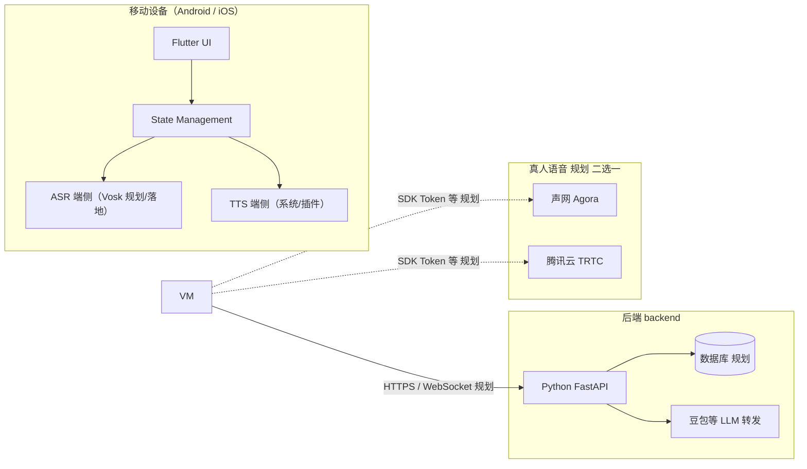

# MyEnglishChat 技术架构说明

**文档类型**：工作区技术总览（单文件 A+1：含【现状】与【规划】）。  
**读者**：维护者、协作者、AI 辅助编程（修改代码前应通读本文与 `.cursor/rules/`）。  
**关联文档**：[`MyEnglishChat-product-intro.md`](./MyEnglishChat-product-intro.md)（产品叙述）。

**后端框架与模块清单**：见 **§5**（含「通常包含哪些内容」）。

---

## 1. 文档维护约定

- 发生以下情况时，**应更新本文**：
  - 新增或删除 **App 分层包**（如引入 `data/`、`ViewModel` 包）；
  - **`backend/`** 增加或变更对外路由，且 **App 计划调用**；
  - 变更 **鉴权方式、Base URL 配置方式**、`applicationId` / 包名；
  - 产品 Tab 与代码入口的对应关系变化；**真人 RTC 选型**（声网 / 腾讯云等）落定。
- **以仓库实际代码为准**；文中【规划】段落仅作目标，**未落地前 AI 不得虚构已存在的类或接口**。

---

## 2. 工作区与仓库边界

| 路径 | 角色 | 说明 |
|------|------|------|
| `app_flutter/` | **Flutter 客户端（主产品：Android+iOS）** | Flutter（Dart）+ Material 3；统一 UI 与业务逻辑；通过 HTTPS/WebSocket 对接 `backend/` |
| `MyEnglishChatApplication/` | **历史 Android 客户端（参考/过渡）** | Kotlin、Jetpack Compose；用于对照迁移与临时验证；不再作为长期主线 |
| `backend/` | **新后端（Python）** | 与客户端 **并列**；**正式对外 API 以本目录为准** |
| `English-Chat/` | **历史网页版（归档参考）** | **不再作为上线产品使用**；其中 FastAPI、路由、业务逻辑仅作**重写后端/理解流程时的参考**，不扩展网页前端 |
| `docs/` | **文档** | 产品介绍、本架构说明等 |
| `.cursor/rules/` | **AI 与协作规则** | 与本文互补；冲突时以**用户最新明确指令**为准 |

---

## 3. 逻辑架构（总览）



**【现状】**：Flutter 客户端骨架将落地于 `app_flutter/`；现有 `MyEnglishChatApplication/` 仅作迁移参考。  
**【规划】**：Flutter 端用清晰的 feature 分层 + 状态管理；网络请求集中在 `data/`（Dart）并指向 `backend/` 部署地址；ASR 优先端侧（Vosk），LLM 经 `backend` 转发，密钥仅在后端；**P2P** 暂定 **声网 Agora** 或 **腾讯云 TRTC**。

**English-Chat**：不参与上图中「正式链路」；仅作**对照实现**时的阅读材料。

---

## 4. Flutter 应用（`app_flutter/`，主客户端）

### 4.1 现状与目标

- **主客户端目录**：`app_flutter/`
- **目标平台**：Android + iOS
- **状态管理**：建议 Riverpod（骨架已引入）
- **网络**：建议 Dio（骨架已引入），Base URL 可配置（debug/真机/模拟器）
- **语音**：端侧离线（Vosk）为主线；录音→本地转写→再请求 `backend` 获取 LLM 回复

### 4.2 目录结构（落地骨架）

```
app_flutter/
├── lib/
│   ├── app/
│   ├── core/
│   ├── data/
│   └── features/
└── pubspec.yaml
```

## 5. 历史 Android 应用（MyEnglishChatApplication，参考/过渡）

### 4.1 【现状】包与文件职责

根包：**`com.example.englishchat`**（与 `namespace` / `applicationId` 一致）。

| 路径 | 职责 |
|------|------|
| `MainActivity.kt` | 入口：`setContent` + `MyEnglishChatApplicationTheme` + `MainScreen()`；**保持精简** |
| `ui/MainScreen.kt` | 底部三 Tab 路由：`AppRoute`、`NavHost`、`EchoBottomBar` 导航逻辑 |
| `ui/components/AppChrome.kt` | 顶栏 `EchoTopBar`、底栏 `EchoBottomBar` |
| `ui/theme/*` | `Color.kt`、`Theme.kt`、`Type.kt`：浅色 Echo 主题与排版 |
| `ui/screens/TabPlaceholderScreens.kt` | **ShadowingScreen**（场景列表）、**AiDialogueScreen**、**P2pScreen** |
| `ui/screens/ScenarioSessionScreen.kt` | 进入某场景后：**Shadowing / Practice** 子标签、Practice 右下角「复习资料」FAB（占位） |

**版本与构建**：见 `MyEnglishChatApplication/gradle/libs.versions.toml`。

### 4.2 产品 Tab → 代码入口（【现状】）

| 产品 Tab | 路由 `AppRoute` | 主要 Composable | 实现时对接 |
|----------|-----------------|-----------------|------------|
| Shadowing | `shadowing` | `ShadowingScreen` | **`backend`** 场景/练习 API（**参考** English-Chat `scene`、`api` 等重写） |
| AI Dialogue | `ai_dialogue` | `AiDialogueScreen` | **`backend`** LLM 代理 / 会话（**参考** `ai_chat`、`websocket` 等） |
| P2P Roleplay | `p2p` | `P2pScreen`（开发中） | **声网或腾讯云 TRTC** SDK + **`backend`** Token / 房间（**参考** `practice_live` 思路） |

### 4.3 【规划】推荐目录结构（渐进落地）

```
com.example.englishchat/
├── MainActivity.kt
├── ui/
├── domain/                # 【规划】
├── data/                  # 【规划】Retrofit、DTO、Repository；调用 backend 部署 URL
│   ├── api/
│   └── repository/
└── di/                    # 【规划】可选
```

**依赖方向**：`ui` → `domain` / `ViewModel` → `data`；**禁止** `data` → `ui`。

| 能力 | 建议位置 |
|------|----------|
| 调用 **`backend` REST** | `data/api/*Api.kt` + `data/repository/*Repository.kt` |
| Token 存储 | `data/local/` |
| 端侧 ASR/TTS | `data/speech/` 或独立模块 |
| RTC | 声网/腾讯官方 Android SDK，封装在 `data/rtc/` 或 `feature/p2p/`（落地时定） |

---

## 6. 后端（`backend/`）

### 5.1 框架与架构（明确说明）

| 项 | 约定 |
|----|------|
| **运行语言** | **Python 3** |
| **Web 框架** | **FastAPI**（异步友好、自动 OpenAPI 文档；与 English-Chat 参考实现同类，便于对照重写） |
| **进程模型** | 单服务或多 worker 由部署决定；开发常用 `uvicorn` |
| **分层原则（推荐）** | **路由层薄**（参数校验、调用 service）；**业务在 service**；**数据库访问单独一层**（如 `crud/` 或 `repositories/`）；**模型**（Pydantic / ORM）与路由响应字段分开，避免把 ORM 直接暴露给 App |

以上为**架构层面的明确约定**；具体子目录名在 **`backend/` 代码落地后**以仓库为准，并回写本节「推荐目录结构」。

### 5.2 后端通常需要包含哪些内容（能力清单 · 规划）

下列模块**按产品迭代逐步出现**，不必第一版全部实现；实现后应在本文或 `backend/README.md` 标注**已落地 / 未开始**。

| 模块 | 作用 | 与 MyEnglishChat 的对应关系 |
|------|------|------------------------------|
| **应用入口** | 创建 FastAPI 实例、挂载路由、CORS、生命周期 | `main.py` 或 `app/main.py` |
| **配置** | 环境变量、数据库 URL、第三方密钥（仅服务端） | `config.py` / `.env`（勿提交密钥） |
| **路由（HTTP/WebSocket）** | 对外 URL，入参出参 | `routers/` 或 `api/` |
| **业务逻辑** | 对话流程、场景推荐、练习校验等 | `services/` 或 `service/` |
| **持久化** | 用户、会话、进度、场景数据等 | ORM **models** + **crud/repositories** + **MySQL/PostgreSQL/SQLite** 等（选型落地后写明） |
| **缓存（可选）** | 会话缓存、限流等 | Redis 等（可选） |
| **鉴权** | 注册登录、JWT 或 Token、密码哈希 | 参考 English-Chat `auth`，在 **backend** 重写 |
| **LLM 集成** | 调用豆包等 API，**密钥只在此** | `services/llm.py` 等；**App 不直连云厂商 LLM 密钥** |
| **RTC 辅助** | 生成声网/腾讯云 **Token**、房间号、简单匹配 | `services/rtc.py` 等；音视频传输由 **客户端 SDK** 完成 |
| **工具** | 日志、统一异常与响应格式 | `utils/` |

**不包含在「必须」里**：为网页服务的 Jinja 模板、静态前端构建物——MyEnglishChat **无网页产品面**。

### 5.3 【规划】推荐目录结构（落地后对齐）

与 English-Chat 类似、便于迁移阅读，可按如下组织（**可微调**）：

```
backend/
├── README.md
├── requirements.txt       # 【规划】
├── .env.example           # 【规划】变量名示例，无真实密钥
├── main.py                # 【规划】或 app/main.py
├── config.py
├── routers/               # HTTP/WebSocket 入口
├── services/              # 业务逻辑
├── crud/ 或 repositories/ # 数据库访问
├── models/                # ORM / 领域模型
└── utils/                 # 鉴权、日志、异常等
```

### 5.4 位置与与 English-Chat 的关系

- **路径**：与 `MyEnglishChatApplication` **同级** **`backend/`**，**不**放入 Android `app/` 模块。
- **English-Chat**：**不**作为运行依赖；仅**打开查阅**后在本目录**重新实现**。

---

## 7. English-Chat（仅参考，非正式后端）

### 6.1 定位

- **历史网页产品**及其当时自带的 FastAPI 实现。
- **用户不再使用网页版产品**；**禁止**将新功能写在 English-Chat 的 HTML/JS 上。
- **用途**：为 **MyEnglishChat** 的**安卓前端**与 **`backend/`** 提供**流程、字段、提示词、数据库设计**等**参考**。

### 6.2 目录与路由索引（查阅用）

| 目录/文件 | 参考价值 |
|-----------|----------|
| `routers/auth.py` | 账号、Token 形态 |
| `routers/api.py` | 综合业务入口 |
| `routers/scene.py` | 场景与进度 |
| `routers/ai_chat.py`、`websocket.py` | AI 对话与实时链路思路 |
| `routers/audio.py` | 音频相关（App 以端侧 ASR/TTS 为主时，后端可能弱化） |
| `routers/practice_live.py` | 真人练习与 **RTC** 结合思路 |
| `service/`、`crud/`、`models/` | 业务与数据模型参考 |

---

## 8. 安全与配置

- **客户端**：不得提交真实 API Key；`local.properties` / 构建配置仅放环境占位。
- **`backend`**：密钥在 `.env` 或部署平台环境变量。
- **RTC**：声网 / 腾讯云 **App ID、证书** 等在**服务端**；客户端用 Token 加入频道。
- **applicationId / 包名**：非必要不改。

---

## 9. 新功能开发检查清单（建议）

1. 确认功能属于 **App** 还是 **`backend/`**，是否需 **RTC**。  
2. 若 English-Chat 有类似能力：**只作对照**，在 **App + backend** 实现，**不**在 English-Chat 上开新网页功能。  
3. **Android**：优先 ViewModel + `data/` Repository，再改 UI。  
4. **新 API**：先在 **`backend/`** 定义，再写 App 端 Retrofit。  
5. 合并前更新 **本文档**（尤其 §5.2 落地状态）与 **`docs/MyEnglishChat-product-intro.md`**（若产品表述变化）。  
6. 对照 **`.cursor/rules/english-chat-android-migration.mdc`**。

---

## 10. 相关文件速查

| 说明 | 路径 |
|------|------|
| Gradle 版本目录 | `MyEnglishChatApplication/gradle/libs.versions.toml` |
| App 构建 | `MyEnglishChatApplication/app/build.gradle.kts` |
| **后端占位与入口说明** | `backend/README.md` |
| 参考用旧项目入口 | `English-Chat/main.py` |
| AI/协作规则 | `AndroidStudioProjects/.cursor/rules/english-chat-android-migration.mdc` |

---

*文末：正式后端目录名为 **`backend/`**；框架 **Python + FastAPI**；模块清单见 §5.2；English-Chat 仅参考；真人 RTC 暂定声网/腾讯云。*
