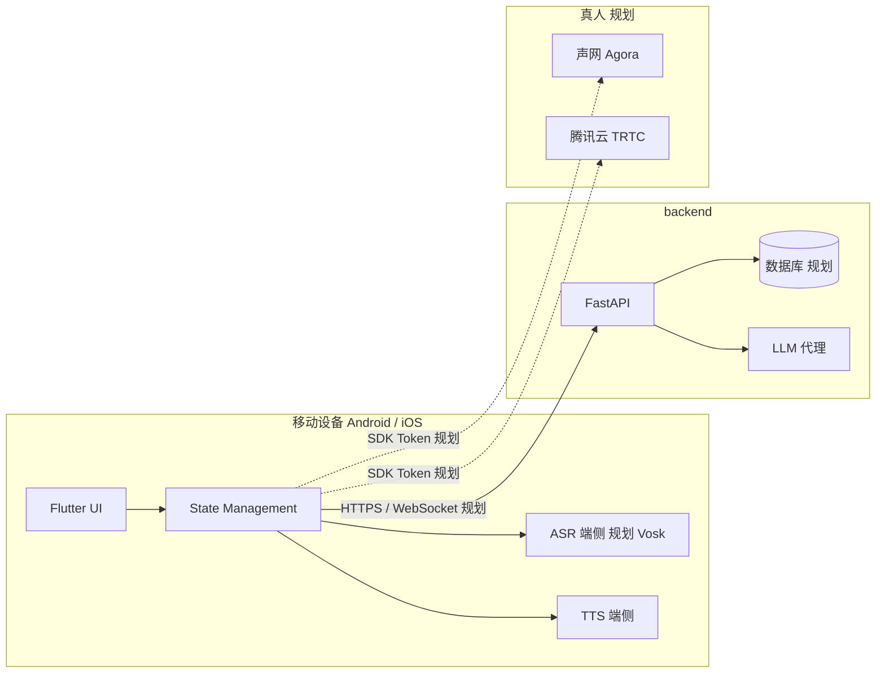

# MyEnglishChat 技术架构说明

**文档类型**：工作区技术总览（含【现状】与【规划】）。  
**读者**：维护者、协作者、AI 辅助编程（修改代码前应通读本文与 **`.cursor/rules/myenglishchat.mdc`**）。  
**关联文档**：[`MyEnglishChat-product-intro.md`](./MyEnglishChat-product-intro.md)（产品叙述）。

**后端能力清单**：见 **§5.2**。

---

## 1. 文档维护约定

- **应更新本文**的情况包括：
  - **`app_flutter/lib/`** 分层或 feature 边界显著变化；
  - **`backend/`** 增加或变更 App **会调用**的对外路由；
  - **Base URL / 鉴权** 约定变化；**RTC**（声网 / 腾讯云）选型落定；
  - 产品 Tab 与代码入口对应关系变化。
- **以仓库实际代码为准**；【规划】未落地前**不得虚构**已存在的类或接口。

---

## 2. 工作区与仓库边界

| 路径 | 角色 | 说明 |
|------|------|------|
| `app_flutter/` | **Flutter 客户端（主产品）** | Android + iOS；Material 3；HTTPS 对接 `backend/` |
| `backend/` | **正式后端** | Python + FastAPI；**对外 API 以本目录为准** |
| `English-Chat/` | **历史网页（仅参考）** | 不扩展网页前端；可读 Python 路由与业务以辅助 **`backend/`** |
| `docs/` | 文档 | 本产品介绍与本架构说明 |
| `.cursor/rules/` | AI 协作规则 | **`myenglishchat.mdc`** 为主；**`code-hygiene-and-reuse.mdc`** 为补充 |

原独立 Kotlin 工程已移除；移动端能力均在 **`app_flutter/`**。

---

## 3. 逻辑架构（总览）



**【现状】**：主客户端 **`app_flutter/`**；Practice 文本对话已调 **`POST /api/practice/chat`**；**Voice Lab** 已接 **Vosk 离线识别**（`vosk_flutter_service`，**Android / iOS** 麦克风流；iOS 需先执行插件 `install`）+ **flutter_tts**；练习主流程内语音转写仍可逐步替换占位，LLM 密钥仅在 **`backend`**。  
**【规划】**：端侧 Vosk 转写；数据库与鉴权按产品迭代接入；P2P 为 **Agora / TRTC** 二选一。

---

## 4. Flutter 应用（`app_flutter/`）

### 4.1 技术栈（骨架现状）

| 项 | 约定 / 依赖 |
|----|----------------|
| UI | Material 3；Echo 主题见 `core/theme/echo_theme.dart` |
| 状态 | **Riverpod** 已在 `pubspec.yaml`（可按 screen 逐步采用） |
| 网络 | **Dio**；客户端 `lib/data/http/dio_client.dart`；Base URL **`core/config/env.dart`** |
| 语音相关 | **`record`** 录音；**`just_audio`** / **`flutter_tts`** 播放；**Vosk**（`vosk_flutter_service`，Android/iOS 麦克风流；模型见 `assets/models/`）；**`permission_handler`**；Voice Lab 见 `features/voice_lab/` |
| 字体 | **`google_fonts`**（如 Shadowing 选题页） |

### 4.2 目录结构（约定 + 现状）

**依赖方向**：**features → data → core**；禁止 **data → features**。

**目标形态（不必空建目录）**：顶层固定为 `app/`、`core/`、`data/`、`features/`；`core` 常见 `config/`、`theme/`、`utils/`；**`core/audio/`**（Vosk 封装、TTS 单例）；`data` 常见 `http/`、`dto/`、`repositories/`。`features/<name>/` 已按 **`presentation/`**（页面与 Widget）、**`domain/`**（路由常量、与 UI 耦合的模型等）拆分；**`application/`**（Controller/Notifier）待按需引入。DTO 与 UI 长期分叉时加 `data/mappers/`。

**当前仓库简图**（随 PR 更新）：

```
app_flutter/lib/
├── main.dart
├── app/           # app.dart、widgets（Echo 顶/底栏）
├── core/          # config/env、theme、audio（Vosk/TTS）
├── data/          # http、dto、repositories
└── features/
    ├── home/presentation/
    ├── shadowing/domain/、presentation/
    ├── session/presentation/
    ├── practice/domain/、presentation/
    ├── ai_dialogue/presentation/
    ├── voice_lab/presentation/
    └── p2p/presentation/
```

### 4.3 目录演进：何时调整、怎么动

| 触发情况 | 建议 |
|----------|------|
| 单文件 **~400 行+** 或同文件同时改 UI + 录音 + API | 拆 **`presentation/`** + **`application/`**（或同级 `*_controller.dart`） |
| **两个 feature** 复制同款录音/播放/权限 | 抽到 **`core/<能力>/`** 或 **`data/local/`**（二选一，勿两套并行） |
| DTO 与界面字段反复手工映射易错 | **`data/mappers/`** 或 feature 内 mapper |
| 深链/多栈路由变复杂 | **`app/router/`**（如 go_router） |
| 独立新产品块 | 新建 **`features/<名>/`**，不塞进 `home/` |

结构性变更后更新 **本节**；协作规则 **`.cursor/rules/myenglishchat.mdc`** 仅保留指针，**不重复粘贴本表**。

### 4.4 导航与产品入口（现状 & 规划）

**【现状（代码）】**

- **外壳**：`HomeScreen` — `EchoTopBar` + 内容区 + `EchoBottomBar`  
  - 当前底栏路由名：`learn`、`p2p_match`、`profile`
- **Learn**：`LearnNavigator` 内嵌 **`Navigator`** — Category → Scenario → Character → Topic → Session（3 mode）
- **Learn Session**：顶部 Tab **Shadowing / Practice / AI Dialogue**  
  - Practice / AI Dialogue：复用 `PracticeSessionPanel`（语音气泡、翻译、优化、分数等 UI 保持一致）
- **Practice 与 LLM**：`PracticeChatRepository` → **`POST /api/practice/chat`**；请求体为 `messages` + 可选 `scenario_title`（当前 Learn Session 也复用该链路）

**【规划（产品 IA）】**

- **底部主导航（3 个板块）**
  - **Learn**：AI 学习与练习（核心闭环：输入/听 → 输出/说）
  - **P2P Match**：真人 1v1 语境实战（Lobby → Match → Room）
  - **Profile**：个人中心与设置（学习数据沉淀）
- **Learn 内部学习界面（顶部 Tab 三连）**
  - **Mode A：Shadowing**（沉浸式跟读，练发音）
  - **Mode B：Practice**（剧本角色扮演，练流利度）
  - **Mode C：AI Dialogue**（开放式自由对话，练应变）
- **Review（学习反馈）**：Practice / AI Dialogue 结束后生成复盘报告（语法/发音/更地道表达）

> 注：规划落地时，Flutter `features/` 的边界将以 **Learn / P2P Match / Profile** 为一级模块；现存 `shadowing/practice/ai_dialogue/p2p` 可逐步迁移或并存过渡，避免一次性大重构。

### 4.5 语音与 LLM UX（目标与现状）

| 环节 | 目标（规则） | 现状 |
|------|----------------|------|
| 录音手势 | 长按开录、上滑取消、松手发送；先停采集再异步写文件 | 已实现（`record` + WAV） |
| 语音气泡 | 立即上屏「转写中…」，完成后更新同一条 | UI 已有；转写为占位 |
| 转写 | 端侧 **Vosk**，预取模型 | 未接 |
| LLM | 仅经 **`backend`** | 已接 `practice/chat` |

#### 4.5.1 端侧模型资源策略（Vosk / 离线 TTS）：不重复下载

**目标**：在开发调试与推广阶段，端侧模型/语音资源做到 **“最多下载一次（或随包）”**，避免每次测试反复下载。

- **存放位置（必须持久化）**
  - 禁止放 cache/tmp（系统可能清理导致重复下载）
  - 选择 documents / applicationSupport 等持久化目录（平台由实现层决定）

- **版本与更新（必须）**
  - 每个资源目录必须带 **版本标记**（如 `model.version` 或 `manifest.json`）
  - 启动或进入功能前：先检查版本是否命中；**命中直接复用**；不命中才触发下载/解压
  - 下载/解压必须 **原子更新**（`*.partial` → 校验 → rename），防止中断造成坏缓存

- **Vosk（ASR）**
  - 支持两种交付：
    - **随包**：无需下载，但增大安装包体积
    - **首次下载并缓存**：仅首次下载一次，后续按版本更新

- **离线 TTS**
  - 若采用 **系统 TTS（Android/iOS）**：离线语音包由系统安装（测试/用户只需一次性下载）；App 不重复下载
  - 若采用 **自带离线 TTS 引擎/模型**：同 Vosk，首次下载并缓存 + 版本更新

**Base URL**：默认 Android 模拟器 **`http://10.0.2.2:8088/`**；真机用  
`flutter run --dart-define=BACKEND_BASE_URL=http://<电脑局域网IP>:8088/`。

### 4.6 后续迭代（摘录）

端侧 **Vosk** 替换占位转写；Shadowing 跟读与场景资源；AI Dialogue 连续对话与后端路由扩展；P2P **RTC + Token**；逐步用 **Riverpod** 收敛巨石 `StatefulWidget`。

---

## 5. 后端（`backend/`）

### 5.1 框架与分层

| 项 | 约定 |
|----|------|
| 语言 / 框架 | **Python 3** + **FastAPI** |
| 运行 | 开发常用 `uvicorn`（见 `main.py`） |
| 分层 | **路由薄**（校验 + 调 service）；**业务在 `services/`**；配置在 **`config.py` + `.env`** |

### 5.2 能力模块（规划清单 · 按迭代落地）

| 模块 | 作用 | 代码落点（现状/规划） |
|------|------|------------------------|
| 应用入口 | FastAPI 实例、路由、健康检查 | `main.py` |
| 配置 | 环境变量、密钥（勿提交） | `config.py`、`.env`、`.env.example` |
| HTTP 路由 | 对外 API | `routers/` |
| LLM | OpenAI 兼容 **chat/completions** | `services/llm.py`；**已用于** `POST /api/practice/chat` |
| 业务扩展 | 场景、用户、RTC 等 | `services/`、未来 `crud/` 等 |
| 持久化 / 鉴权 | DB、JWT | 规划 |

**不要求**：网页模板、静态前端构建物。

### 5.3 推荐目录结构（可随代码微调）

```
backend/
├── main.py
├── config.py
├── requirements.txt
├── .env.example
├── routers/
├── services/
└── （规划）crud/、models/、utils/
```

### 5.4 与 English-Chat 的关系

- **`backend/`** 与 **`app_flutter/`** **同级**，不属于 Flutter 子工程。
- **English-Chat** 不作运行依赖；仅作阅读参考后在 **`backend/`** **重写**。

---

## 6. English-Chat（仅参考）

### 6.1 定位

历史网页版及附带 FastAPI；**禁止**扩展其 HTML/JS/CSS；可为 **`backend/`** 与业务流程提供**字段与路由思路**。

### 6.2 查阅索引

| 路径 | 参考价值 |
|------|----------|
| `routers/auth.py` | 鉴权形态 |
| `routers/scene.py`、`routers/api.py` | 场景与综合 API |
| `routers/ai_chat.py`、`websocket.py` | 对话与实时思路 |
| `routers/practice_live.py` | 真人与 RTC 思路 |
| `service/`、`models/` | 业务与模型 |

---

## 7. 安全与配置

- **客户端**：无云厂商密钥；环境用 `env.dart` + dart-define。
- **`backend/.env`**：`OPENAI_API_KEY`、`OPENAI_BASE_URL`、`OPENAI_MODEL` 等（见 **`backend/.env.example`**）。
- **RTC**：App ID / 证书等在**服务端**。
- **Flutter `applicationId` / iOS Bundle ID**：非必要不改。

## 7.1 商业化与许可（待确认）

**现状**：端侧离线英文 TTS 使用 **`flutter_kitten_tts`**（KittenML ONNX，包声明 **MIT**）。首次初始化会从 HuggingFace 拉取模型与语音数据（约数十 MB），缓存在应用支持目录，符合「不重复下载」策略（见 §4.5.1）。

**仍需核对**：

- **模型与数据许可**：KittenML / 随包下载的 ONNX、voices、espeak-ng 数据等，是否在目标分发场景（地区、商用、闭源）下可用；以官方仓库与 HuggingFace 卡片为准。
- **系统 TTS 回退**：`flutter_tts` 仍可作为失败时的回退；各平台离线语音包许可由系统/厂商侧管理。
- **Android / `libespeak-ng.so`**：Kitten 依赖插件自带的 **espeak-ng** 动态库。若 Logcat 出现 **`dlopen failed: library "libespeak-ng.so" not found`**：工程已在 **`MainActivity`** 里 **`System.loadLibrary("espeak-ng")`** 预加载（便于 FFI 解析）；若仍失败，请确认设备 ABI 为 **arm64-v8a / armeabi-v7a / x86_64**（避免仅 **x86** 32 位模拟器），并 **`flutter clean` 后全量重编**。插件原生构建需要本机安装 **Android SDK CMake**（3.18+），否则 Gradle 会在 `:flutter_kitten_tts:configureCMake*` 阶段失败。

> 上线前建议再扫一遍依赖与模型条款；本节不阻塞日常开发调试。

---

## 8. 新功能检查清单

1. 功能落在 **`app_flutter/`** 还是 **`backend/`**？是否涉及 RTC？  
2. English-Chat 仅有**对照**意义；实现在 **Flutter + backend**。  
3. 优先 **`features/` + `data/`**，再改 UI。  
4. **新 API**先 **`backend/`** 再 Flutter **`data/`**。  
5. 更新 **本文**（尤其 §5.2 落地状态）及 **`MyEnglishChat-product-intro.md`**（若产品表述变）。  
6. 遵守 **`.cursor/rules/myenglishchat.mdc`** 与 **`code-hygiene-and-reuse.mdc`**。

---

## 9. 相关路径速查

| 说明 | 路径 |
|------|------|
| Flutter 工程 | `app_flutter/pubspec.yaml` |
| 环境变量说明 | `backend/.env.example` |
| 后端说明 | `backend/README.md` |
| 参考旧站入口 | `English-Chat/main.py`（只读） |

---

*主客户端：**`app_flutter/`**；后端：**`backend/`**（FastAPI）；English-Chat 仅参考；真人 RTC：声网 / 腾讯云待定。*
